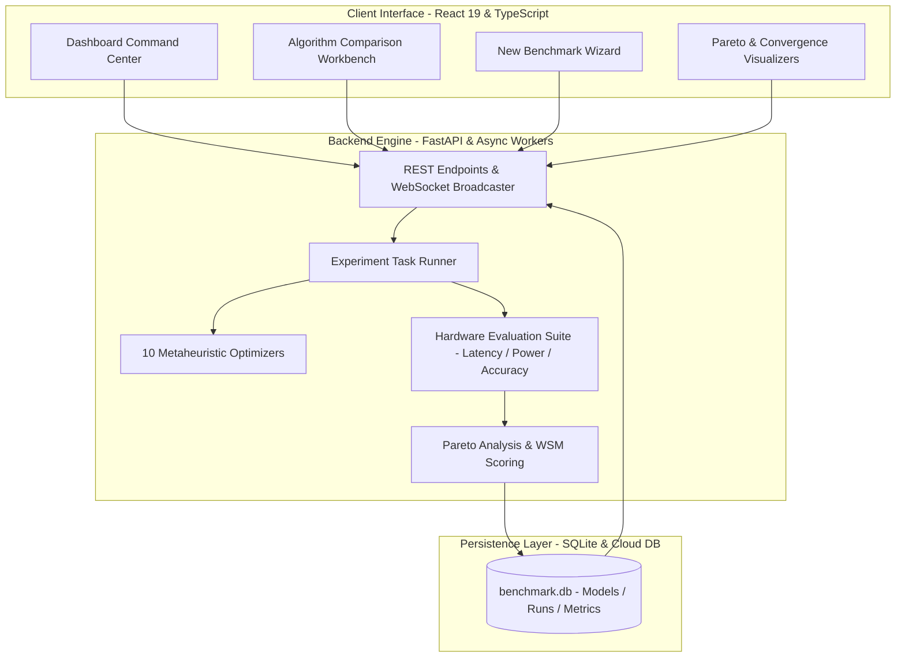

# 🔬 CNN Optimization Benchmark Platform

<div align="center">

[](https://cnn.umeshlabs.in/)
[](https://www.python.org/)
[](https://fastapi.tiangolo.com/)
[](https://react.dev/)
[](https://www.typescriptlang.org/)
[](https://vitejs.dev/)
[](https://tailwindcss.com/)
[](https://docs.pytest.org/)
[](LICENSE)

**A Scientific Research Workstation & Laboratory Platform for Empirically Benchmarking Metaheuristic Optimization Algorithms on Deep CNN Compression**

🌐 **[Visit Live Deployment: cnn.umeshlabs.in](https://cnn.umeshlabs.in/)**

[Live Web App](https://cnn.umeshlabs.in/) • [Features](#-key-features) • [Architecture](#-system-architecture) • [Algorithms](#-benchmarked-metaheuristic-algorithms) • [Installation](#-quick-start--installation) • [API](#-rest--websocket-api) • [Documentation](docs/WIKI.md) • [Author](#-author--maintainer)

</div>

---

## 🎯 Core Research Problem

> **“Which metaheuristic optimization algorithm achieves the superior multi-objective Pareto trade-off between Top-1 Accuracy, Inference Latency, Continuous Power Draw, Computational Complexity (FLOPs/TOPs), Model Footprint, and Energy Consumption under identical hardware and compression constraints?”**

The **CNN Optimization Benchmark Platform** provides an empirical, reproducible, and standardized research workstation to compare **10 state-of-the-art metaheuristics** (plus user-registered custom algorithms) across deep Convolutional Neural Networks (ResNet-18, MobileNetV2, ShuffleNetV2, VGG-16, EfficientNet-B0) on standardized vision benchmarks (CIFAR-10, CIFAR-100, MNIST, Fashion-MNIST, ImageNet-1k Subset) and custom dataset uploads.

---

## ✨ Key Features

- 🎛️ **Algorithm Comparison Workbench**: Interactive side-by-side comparison with real-time dynamic objective re-weighting (Accuracy, Latency, Size, Energy sliders) and live score re-computation.
- 📐 **Scientific Workstation UI/UX**: Designed following laboratory instrumentation principles using **`IBM Plex Sans`** and **`IBM Plex Mono`** typography, dense analytical data tables, and structured research navigation.
- ⚡ **Dual Compute Target (GPU & CPU)**: Full hardware telemetry for NVIDIA GPUs (`torch.cuda` with `pynvml` power sampling) and Multi-Core CPUs with high-resolution synchronized latency timings.
- 🔌 **Continuous Power & Compute Throughput Profiling**: Real-time measurement and analytical modeling of Average Power Draw ($\text{Watts} = \frac{\text{Joules}}{\text{Latency (s)}}$) and Compute Throughput ($\text{TOPs}$).
- 📉 **Multi-Objective Pareto Analysis**: Automatic extraction and 6-axis interactive visualization of the empirical non-dominated frontier.
- 📈 **Convergence & Stochastic Telemetry**: Real-time WebSocket iteration tracking and multi-run statistical boxplots (Mean, Median, Std Dev, Min, Max, 95% Student's $t$ Confidence Intervals).
- 🧩 **5-Stage Ablation Decomposition**: Isolates the marginal contributions of Quantization (FP16/INT8), Pruning (Structured Channel / Filter), and Metaheuristic Optimization.
- 🏷️ **Data Provenance Badging**: Explicit scientific provenance labeling (`● MEASURED`, `◆ CALCULATED`, `▲ ESTIMATED`, `DEMO DATA`).
- 📁 **Custom Extensibility**: 1-Click modal uploads for custom Python optimizers (`BaseOptimizer`), custom image dataset archives (.zip), and custom PyTorch CNN architectures.
- 📄 **Publication-Ready Exports**: 1-Click downloads in **CSV**, **JSON**, **Markdown**, **Microsoft Word (.doc)**, and **Plain Text (.txt)** formats.

---

## 🔬 Benchmarked Metaheuristic Algorithms

All algorithms adhere to the standardized `BaseOptimizer` mathematical search contract over continuous decision spaces $\mathbf{x} \in [0.0, 1.0]^D$:

| Key | Algorithm Name | Family | Citation | Search Complexity |
| :--- | :--- | :--- | :--- | :--- |
| **GWO** | Grey Wolf Optimizer | Swarm Intelligence | Mirjalili et al. (2014) | $\mathcal{O}(N \times D)$ |
| **WOA** | Whale Optimization Algorithm | Swarm Intelligence | Mirjalili & Lewis (2016) | $\mathcal{O}(N \times D)$ |
| **ALO** | Ant Lion Optimizer | Swarm Intelligence | Mirjalili (2015) | $\mathcal{O}(N \times D)$ |
| **MFO** | Moth-Flame Optimization | Physics / Biology | Mirjalili (2015) | $\mathcal{O}(N \times D)$ |
| **GOA** | Grasshopper Optimization Algorithm | Swarm Intelligence | Saremi et al. (2017) | $\mathcal{O}(N^2 \times D)$ |
| **MVO** | Multi-Verse Optimizer | Physics / Cosmology | Mirjalili et al. (2016) | $\mathcal{O}(N \times D)$ |
| **SCA** | Sine Cosine Algorithm | Mathematical Trigonometric | Mirjalili (2016) | $\mathcal{O}(N \times D)$ |
| **AOA** | Arithmetic Optimization Algorithm | Mathematical Algebraic | Abualigah et al. (2021) | $\mathcal{O}(N \times D)$ |
| **MGO** | Mountain Gazelle Optimizer | Swarm Intelligence | Abdollahzadeh et al. (2022) | $\mathcal{O}(N \times D)$ |
| **GMO** | Geometric Mean Optimizer | Mathematical Geometric | Mirrashid & Naderpour (2023) | $\mathcal{O}(N \times D)$ |

---

## 🏗️ System Architecture & Workflow



---

## 📐 Mathematical Formulation

### 1. Weighted Sum Model (WSM) Composite Scoring

$$\text{Composite Score}_i = \left( w_{\text{acc}} \cdot \tilde{A}_i + w_{\text{lat}} \cdot \tilde{L}_i + w_{\text{size}} \cdot \tilde{S}_i + w_{\text{energy}} \cdot \tilde{E}_i \right) \times 100$$

Where $\tilde{A}_i, \tilde{L}_i, \tilde{S}_i, \tilde{E}_i \in [0, 1]$ are min-max normalized metrics across all algorithms with inverse transformation for minimization metrics (Latency, Size, Energy).

### 2. Multi-Objective Fitness Evaluation

$$f(\mathbf{x}) = w_{\text{acc}} \left(\frac{\Delta \text{Acc}(\mathbf{x})}{\text{Acc}_{\text{baseline}}}\right) + w_{\text{lat}} \left(\frac{\text{Lat}(\mathbf{x})}{\text{Lat}_{\text{baseline}}}\right) + w_{\text{size}} \left(\frac{\text{Size}(\mathbf{x})}{\text{Size}_{\text{baseline}}}\right) + w_{\text{energy}} \left(\frac{\text{Energy}(\mathbf{x})}{\text{Energy}_{\text{baseline}}}\right)$$

### 3. Compute Throughput Density (TOPs)

$$\text{TOPs} = \frac{\text{FLOPs (M)} \times 10^6}{\text{Latency (ms)} \times 10^{-3} \times 10^{12}} = \frac{\text{FLOPs (M)}}{\text{Latency (ms)} \times 10^6}$$

---

## 🚀 Quick Start & Installation

### Prerequisites
- **Python 3.10+** (Tested on Python 3.10, 3.11, 3.12, 3.14)
- **Node.js v18+** & `npm`
- **Git**

### 1. Clone Repository & Setup Backend
```bash
# Clone the repository
git clone https://github.com/UmeshCode1/cnn-optimization-benchmark.git
cd cnn-optimization-benchmark

# Install Python dependencies
python -m pip install -r requirements.txt

# Launch FastAPI Backend Server
python -m uvicorn backend.main:app --host 0.0.0.0 --port 8000 --reload
```

### 2. Setup & Launch Frontend Workstation
In a separate terminal window:
```bash
cd frontend
npm install
npm run dev
```

Visit **`http://localhost:5173`** (or **`http://localhost:8000`** for FastAPI production bundle).

---

## 🧪 Comprehensive Test Suite

Run full automated test verification covering API endpoints, evaluators, and all 10 optimizers:
```bash
python -m pytest tests backend/tests -v
```

```
======================== 35 passed, 1 warning in 1.50s ========================
```

---

## 📚 REST & WebSocket API Catalog

| Method | Endpoint | Description |
| :--- | :--- | :--- |
| `POST` | `/api/experiments` | Create and trigger an asynchronous benchmark experiment |
| `GET` | `/api/experiments` | List all historical benchmark runs with metadata filters |
| `GET` | `/api/experiments/{id}` | Retrieve comprehensive results, statistics, Pareto points, and ablations |
| `POST` | `/api/experiments/{id}/recalculate` | Live dynamic recalculation of scores and rankings with custom weights |
| `GET` | `/api/reports/{id}/csv` | Export results in CSV format |
| `GET` | `/api/reports/{id}/json` | Export results in JSON format |
| `GET` | `/api/reports/{id}/markdown` | Export formatted Markdown research report |
| `GET` | `/api/reports/{id}/doc` | Export Microsoft Word (.doc) formatted report |
| `GET` | `/api/reports/{id}/txt` | Export formatted Plain Text (.txt) report |
| `WS` | `/api/experiments/{id}/ws` | Real-time WebSocket stream for live iteration telemetry |
| `GET` | `/api/algorithms` | List all verified and custom metaheuristic optimizers |
| `POST` | `/api/algorithms` | Register a new custom metaheuristic optimizer plugin |
| `GET` | `/api/datasets` | List available datasets and resolution parameters |
| `POST` | `/api/datasets/upload` | Upload a custom image dataset archive |
| `GET` | `/api/models` | List supported CNN model architectures |
| `GET` | `/api/hardware` | Inspect host CPU/GPU hardware profile and telemetry |

---

## 📖 Complete Documentation & GitHub Wiki

- 🏛️ [System Architecture & Data Flows](docs/architecture.md)
- 🧮 [Mathematical Formulations of 10 Metaheuristics](docs/algorithms.md)
- 📑 [GitHub Wiki Master Blueprint](docs/WIKI.md)
- ⚙️ [Benchmarking & Reproducibility Guide](docs/reproducibility.md)
- 🔌 [Complete REST & WebSocket API Reference](docs/api.md)

---

## 👨‍💻 Author & Maintainer

<div align="left">

### **Umesh Patel**
*AI & Deep Learning Systems Researcher / Software Engineer*

- **Website / Platform**: [https://cnn.umeshlabs.in/](https://cnn.umeshlabs.in/)
- **GitHub**: [@UmeshCode1](https://github.com/UmeshCode1)
- **Repository**: [https://github.com/UmeshCode1/cnn-optimization-benchmark](https://github.com/UmeshCode1/cnn-optimization-benchmark)
- **Specialization**: Deep Learning Model Compression, Metaheuristic Optimization, Edge AI Hardware Acceleration, and High-Performance Benchmarking.

</div>

---

## 📄 License & Citation

This project is licensed under the **MIT License** — see the [LICENSE](LICENSE) file for details.

If you utilize this benchmark workstation in academic or industrial research, please cite:

```bibtex
@software{umesh_patel_cnn_benchmark_2026,
  author = {Umesh Patel},
  title = {CNN Optimization Benchmark: A Scientific Research Platform for Metaheuristics in Deep Convolutional Neural Network Compression},
  year = {2026},
  publisher = {GitHub},
  journal = {GitHub repository},
  howpublished = {\url{https://cnn.umeshlabs.in/}}
}
```
