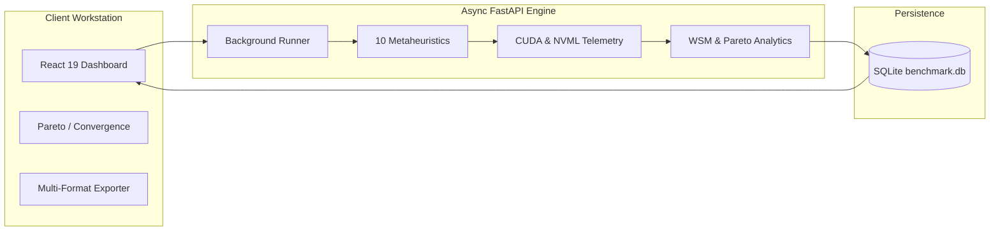

# GitHub Wiki Master Blueprint & Project Manual

This document provides the ready-to-publish master blueprint for the **[GitHub Wiki](https://github.com/UmeshCode1/cnn-optimization-benchmark/wiki)**, covering system architecture, mathematical derivations, reproducibility protocols, API specifications, and deployment.

---

## 📑 Wiki Sitemap & Architecture Navigation

| Wiki Page | Primary Topics Covered | Markdown Link |
| :--- | :--- | :--- |
| **1. Home** | Mission, Research Problem, 10 Metaheuristics, 4 Core Pillars | [Home](https://github.com/UmeshCode1/cnn-optimization-benchmark/wiki/Home) |
| **2. System Architecture** | 3-Tier System, Asynchronous Worker Pipeline, SQLite Schema | [Architecture](https://github.com/UmeshCode1/cnn-optimization-benchmark/blob/master/docs/architecture.md) |
| **3. Algorithm Formulations** | Mathematical Equations, Search Vectors, Exploration/Exploitation | [Algorithms](https://github.com/UmeshCode1/cnn-optimization-benchmark/blob/master/docs/algorithms.md) |
| **4. Benchmarking & Reproducibility** | CUDA Synchronized Timing, Seed Policy, Statistical Confidence | [Reproducibility](https://github.com/UmeshCode1/cnn-optimization-benchmark/blob/master/docs/reproducibility.md) |
| **5. REST & WebSocket API** | Complete Endpoint Catalog, WebSocket Packet Specifications | [API Reference](https://github.com/UmeshCode1/cnn-optimization-benchmark/blob/master/docs/api.md) |
| **6. Compression & Telemetry** | PTQ Quantization (FP16/INT8), Structured L1 Pruning, NVML Power | [Compression](https://github.com/UmeshCode1/cnn-optimization-benchmark/blob/master/docs/quantization.md) |
| **7. Multi-Objective Scoring & Pareto** | Weighted Sum Model (WSM), Non-Dominated 2D/3D Frontier | [Scoring](https://github.com/UmeshCode1/cnn-optimization-benchmark/blob/master/docs/metrics.md) |
| **8. Deployment & Docker** | Docker Compose, Render Deployment, Hardware Configuration | [Deployment](https://github.com/UmeshCode1/cnn-optimization-benchmark/blob/master/docs/deployment.md) |

---

## 🏛️ System Architecture & Data Flow Overview



---

## 🧮 Summary of Mathematical Formulations

Every metaheuristic optimizer operates on a continuous hyperparameter vector $\vec{X} \in [0.0, 1.0]^D$. The multi-objective evaluation engine minimizes:

$$\min_{\vec{X}} f(\vec{X}) = w_{\text{acc}} \cdot \Delta \text{Acc}(\vec{X}) + w_{\text{lat}} \cdot \widetilde{\text{Lat}}(\vec{X}) + w_{\text{size}} \cdot \widetilde{\text{Size}}(\vec{X}) + w_{\text{energy}} \cdot \widetilde{\text{Energy}}(\vec{X})$$

### The 10 Benchmark Metaheuristics:
1. **GWO (Grey Wolf Optimizer)**: Hierarchical leadership hunting ($\alpha, \beta, \delta$).
2. **WOA (Whale Optimization Algorithm)**: Logarithmic spiral bubble-net feeding.
3. **ALO (Ant Lion Optimizer)**: Random walks trapped in conical sand pits.
4. **MFO (Moth-Flame Optimization)**: Logarithmic spiral transverse orientation.
5. **GOA (Grasshopper Optimization Algorithm)**: Social swarm attraction and repulsion.
6. **MVO (Multi-Verse Optimizer)**: White hole expansion and wormhole tunneling.
7. **SCA (Sine Cosine Algorithm)**: Trigonometric amplitude oscillation.
8. **AOA (Arithmetic Optimization Algorithm)**: Algebraic math operators ($\div, \times, -, +$).
9. **MGO (Mountain Gazelle Optimizer)**: Dynamic harem dominance and bachelor migration.
10. **GMO (Geometric Mean Optimizer)**: Multi-dimensional geometric centroid vectors.

---

## ⚙️ Scientific Reproducibility Protocol

* **Deterministic Seed Policy**: `seed = base_seed + run_index` for every stochastic run.
* **Warmup Cycles**: 50 unmeasured forward passes to eliminate GPU thermal throttling and driver jitter.
* **CUDA Synchronization**: `torch.cuda.synchronize()` surrounding 200 measured passes.
* **NVML Power Integral**: Continuous high-frequency GPU sampling for exact Joule measurements.
* **Statistical Rigor**: Mean, Median, Standard Deviation, and 95% Student's $t$ Confidence Intervals.

---

## 🔌 API & Client Integration Quickstart

```python
import requests

# 1. Trigger benchmark
response = requests.post("https://cnn.umeshlabs.in/api/experiments", json={
    "title": "CIFAR-10 ResNet-18 Benchmark",
    "dataset_name": "CIFAR-10",
    "cnn_model_name": "ResNet-18",
    "quantization_type": "INT8",
    "pruning_ratio": 0.40,
    "selected_algorithms": ["GWO", "WOA", "MGO"],
    "max_iterations": 25,
    "number_of_runs": 3
})

exp_id = response.json()["id"]
print(f"Benchmark created: {exp_id}")

# 2. Fetch full results and Pareto winners
results = requests.get(f"https://cnn.umeshlabs.in/api/experiments/{exp_id}").json()
print(f"Winner: {results['best_algorithm']} - {results['best_algorithm_reason']}")
```
