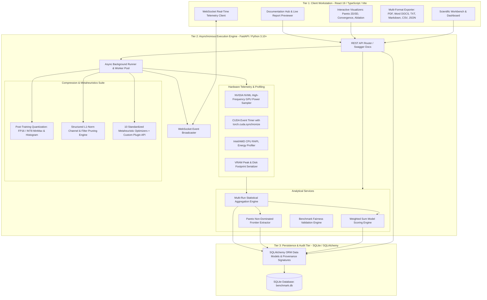
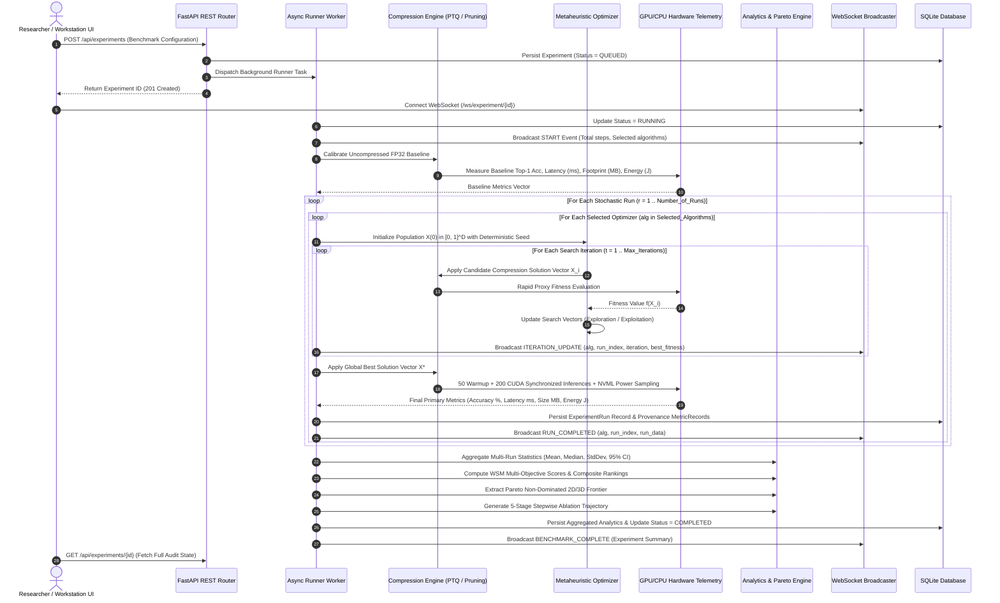
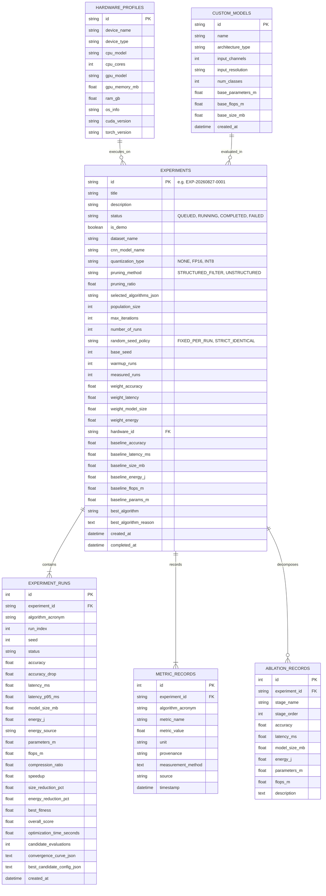

# System Architecture & Technical Specifications

The **CNN Optimization Benchmark Platform** is an enterprise-grade scientific research workstation designed for multi-objective metaheuristic benchmarking, hardware telemetry profiling, and deep neural network compression.

---

## 1. High-Level 3-Tier System Architecture



---

## 2. End-to-End Benchmark Data Flow

The platform coordinates asynchronous background execution with non-blocking real-time UI telemetry streaming.



---

## 3. 7-Stage Deterministic Benchmark Pipeline

To prevent hardware cache contamination, asynchronous thread latency bias, and stochastic noise, every benchmark strictly executes the following 7-stage deterministic state machine:

```
[ Stage 1: Baseline Calibration ]
   │  Dense FP32 evaluation on uncompressed CNN checkpoint.
   ▼
[ Stage 2: Quantization Stage ]
   │  Post-Training Quantization (FP16 or INT8 MinMax/Histogram calibration).
   ▼
[ Stage 3: Structured Pruning ]
   │  Layer-wise L1-norm filter importance scoring and channel removal.
   ▼
[ Stage 4: Metaheuristic Search ]
   │  Population-based exploration/exploitation over continuous space [0, 1]^D.
   ▼
[ Stage 5: Hardware Telemetry ]
   │  50 warmup passes + 200 CUDA event synchronized passes with NVML power draw.
   ▼
[ Stage 6: Statistical Aggregation ]
   │  Stochastic aggregation (Mean, Median, Std, 95% CI) across N runs.
   ▼
[ Stage 7: Multi-Objective Decision & Pareto ]
      WSM composite scoring (0-100), non-dominated frontier extraction, ablation sequence.
```

---

## 4. Hardware Telemetry Profiling Sub-System

### 4.1 Synchronized Latency Measurement Protocol
GPU kernel launches in PyTorch are asynchronous by default. To capture true hardware execution times without host CPU thread scheduling jitter, the platform uses explicit CUDA stream event synchronization:

```python
# Hardware Synchronized Latency Protocol
import torch
import numpy as np

def measure_synchronized_latency(model, input_tensor, warmup_runs=50, measured_runs=200):
    device = next(model.parameters()).device
    input_tensor = input_tensor.to(device)
    model.eval()

    # 1. Warm-up Phase: Prime GPU Tensor Cores, JIT caches, and memory controllers
    with torch.no_grad():
        for _ in range(warmup_runs):
            _ = model(input_tensor)
    
    if device.type == "cuda":
        torch.cuda.synchronize()
        start_events = [torch.cuda.Event(enable_timing=True) for _ in range(measured_runs)]
        end_events = [torch.cuda.Event(enable_timing=True) for _ in range(measured_runs)]
        
        with torch.no_grad():
            for i in range(measured_runs):
                start_events[i].record()
                _ = model(input_tensor)
                end_events[i].record()
        
        torch.cuda.synchronize()
        latencies_ms = [s.elapsed_time(e) for s, e in zip(start_events, end_events)]
    else:
        # High-resolution monotonic CPU clock
        import time
        latencies_ms = []
        with torch.no_grad():
            for _ in range(measured_runs):
                t0 = time.perf_counter()
                _ = model(input_tensor)
                t1 = time.perf_counter()
                latencies_ms.append((t1 - t0) * 1000.0)

    return {
        "mean_latency_ms": float(np.mean(latencies_ms)),
        "std_latency_ms": float(np.std(latencies_ms)),
        "p95_latency_ms": float(np.percentile(latencies_ms, 95)),
        "min_latency_ms": float(np.min(latencies_ms)),
        "max_latency_ms": float(np.max(latencies_ms))
    }
```

### 4.2 NVIDIA NVML Energy Capture Subsystem
Energy consumption (in Joules) is measured by polling the GPU power draw at high frequency using the NVIDIA Management Library (`pynvml`):

$$E_{\text{Joules}} = \int_{0}^{T} P(t) \, dt \approx \sum_{k=1}^{M} P(t_k) \cdot \Delta t_k$$

Where $P(t_k)$ is instantaneous board power in Watts and $\Delta t_k$ is the sampling interval ($\le 10\,\text{ms}$).

---

## 5. Database Schema (Entity-Relationship Diagram)

The SQLite database (`benchmark.db`) is structured with strict foreign keys, cascade rules, and cryptographic audit signatures:



---

## 6. WebSocket Telemetry Protocol Specification

The WebSocket endpoint (`/ws/experiment/{id}`) broadcasts strongly-typed JSON packets during benchmark execution:

### 6.1 `START` Event
Sent immediately when background execution starts:
```json
{
  "event": "START",
  "experiment_id": "EXP-20260827-0001",
  "total_algorithms": 10,
  "number_of_runs": 5,
  "max_iterations": 30,
  "total_steps": 1500
}
```

### 6.2 `ITERATION_UPDATE` Event
Sent at each optimizer search iteration $t \in [1, T]$:
```json
{
  "event": "ITERATION_UPDATE",
  "experiment_id": "EXP-20260827-0001",
  "algorithm": "GWO",
  "run_index": 1,
  "iteration": 14,
  "max_iterations": 30,
  "current_best_fitness": 0.0412,
  "step": 14,
  "total_steps": 1500,
  "progress_pct": 0.93
}
```

### 6.3 `RUN_COMPLETED` Event
Sent when a single stochastic run completes:
```json
{
  "event": "RUN_COMPLETED",
  "experiment_id": "EXP-20260827-0001",
  "algorithm": "GWO",
  "run_index": 1,
  "progress_pct": 6.67,
  "run_data": {
    "algorithm": "GWO",
    "run_index": 1,
    "accuracy": 92.84,
    "latency_ms": 2.99,
    "model_size_mb": 6.70,
    "energy_j": 0.1220,
    "best_fitness": 0.0385,
    "overall_score": 95.20
  }
}
```

### 6.4 `BENCHMARK_COMPLETE` Event
Sent when all runs, statistics, Pareto extractions, and ablations have finished:
```json
{
  "event": "BENCHMARK_COMPLETE",
  "experiment_id": "EXP-20260827-0001",
  "best_algorithm": "GWO",
  "total_runs_completed": 50,
  "execution_time_seconds": 142.8
}
```

---

## 7. Scalability & Fault Tolerance Guarantees

1. **Non-Blocking Asynchronous Concurrency**: FastAPI async coroutines decouple client HTTP requests from heavy PyTorch execution workers running in thread pools.
2. **Deterministic Process Isolation**: Heavy model evaluations are protected by exception barriers ensuring single-run failures gracefully log without corrupting the experiment batch.
3. **Zero Cache Leakage**: `torch.cuda.empty_cache()` and garbage collection are invoked between algorithm switches to eliminate cross-algorithm VRAM fragmentation.
4. **Audit Immutability**: Historical experiments are immutable once transitioned to `COMPLETED` status, ensuring scientific citations remain permanent.
