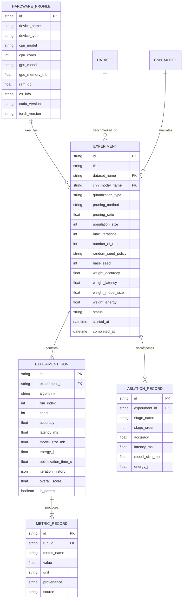

# System Architecture & Technical Specifications

This document outlines the system architecture, component contracts, asynchronous execution engine, database schema, and telemetry pipelines of the **CNN Optimization Benchmark Platform**.

---

## 1. High-Level System Architecture

```mermaid
graph TB
    subgraph Client Layer ["Client Tier (React 19 + TypeScript + Tailwind CSS)"]
        UI["Scientific Research Workstation UI"]
        WB["Algorithm Comparison Workbench"]
        Plots["Interactive SVG Visualizations (Pareto, Boxplot, Convergence)"]
        WSClient["WebSocket Client (Live Telemetry & Iteration Broadcaster)"]
    end

    subgraph Backend Layer ["Backend Tier (FastAPI Asynchronous Engine)"]
        Router["REST API Router (/api/experiments, /api/algorithms, /api/datasets)"]
        WSServer["WebSocket Telemetry Broadcaster (/api/experiments/{id}/ws)"]
        Worker["Async Experiment Runner & Task Queue"]
        
        subgraph Core Services ["Analytical & Statistical Services"]
            ScoringSvc["Scoring Service (WSM Multi-Objective Scoring)"]
            ParetoSvc["Pareto Service (Non-Dominated Sorting Frontier)"]
            StatsSvc["Statistics Service (95% CI, Variance, Median)"]
            AblationSvc["Ablation Service (5-Stage Sequential Decomposition)"]
            ExportSvc["Export Service (CSV, JSON, Markdown, LaTeX)"]
        end

        subgraph Evaluation Suite ["High-Precision Evaluation Engine"]
            AccEval["Accuracy Evaluator (Standardized Test Split)"]
            LatEval["Latency Evaluator (CUDA Sync + Warmup Cycles)"]
            SizeEval["Model Size Evaluator (Serialized Weight Footprint)"]
            EnergyEval["Energy Evaluator (NVML Power Sampling & TDP Calibrated Model)"]
            FlopsEval["FLOPs & Parameter Counter"]
            QuantMgr["Quantization Manager (FP32, FP16, INT8 PTQ)"]
            PruneMgr["Pruning Manager (Structured L1-Channel & Unstructured)"]
        end

        subgraph Optimizers ["Metaheuristic Algorithm Registry"]
            BaseOpt["BaseOptimizer Standard Contract"]
            Algs["GWO, WOA, ALO, MFO, GOA, MVO, SCA, AOA, MGO, GMO + Custom Plugins"]
        end
    end

    subgraph Storage Layer ["Persistence Tier (SQLite + SQLAlchemy ORM)"]
        DB[(benchmark.db)]
        ModelsTable["CNN Models Registry"]
        DatasetsTable["Datasets & Custom Data Archives"]
        ExperimentsTable["Experiments & Parameter Configurations"]
        RunsTable["Experiment Runs & Iteration History"]
        MetricsTable["Evaluation Metrics & Telemetry Records"]
        AblationsTable["Ablation Decomposition Records"]
    end

    UI --> Router
    WSClient <--> WSServer
    Router --> CoreServices
    Router --> Worker
    Worker --> Optimizers
    Worker --> Evaluation Suite
    Worker --> WSServer
    Worker --> StorageLayer
    CoreServices --> StorageLayer
```

---

## 2. Asynchronous Execution Pipeline

Every benchmark execution follows a deterministic, 7-stage pipeline:

```mermaid
sequenceDiagram
    autonumber
    actor Researcher as Researcher / Client UI
    participant API as FastAPI REST Router
    participant Worker as Async Runner Worker
    participant Opt as Metaheuristic Optimizer
    participant Eval as Evaluation Suite
    participant WS as WebSocket Broadcaster
    participant DB as SQLite Database

    Researcher->>API: POST /api/experiments (Benchmark Configuration)
    API->>DB: Persist Experiment (Status = QUEUED)
    API->>Worker: Dispatch Background Task
    API-->>Researcher: Return Experiment ID (201 Created)
    
    Researcher->>WS: Connect WebSocket /api/experiments/{id}/ws
    
    Worker->>DB: Update Status = RUNNING
    Worker->>WS: Broadcast START Event
    
    loop For Each Stochastic Run (r = 1 .. N)
        loop For Each Selected Optimizer (alg in Selected)
            Worker->>Opt: Initialize Population X(0) ~ U(0, 1)^D with Seed(base + r)
            loop For Each Iteration (t = 1 .. T)
                Opt->>Eval: Evaluate Multi-Objective Fitness f(x)
                Opt->>Opt: Update Particle / Agent Positions
                Opt-->>Worker: Best Fitness at Iteration t
                Worker->>WS: Broadcast ITERATION_UPDATE (alg, run, t, fitness)
            end
            Worker->>Eval: Final Evaluation on Hardware (Acc, Latency, Size, Energy)
            Worker->>DB: Persist ExperimentRun Record
        end
    end

    Worker->>Worker: Aggregate Statistics (Mean, Median, Std, 95% CI)
    Worker->>Worker: Compute Multi-Objective Weighted Scores & Rankings
    Worker->>Worker: Extract Pareto Non-Dominated Frontier
    Worker->>Worker: Compute 5-Stage Ablation Sequence
    Worker->>DB: Update Status = COMPLETED
    Worker->>WS: Broadcast BENCHMARK_COMPLETE
    Researcher->>API: GET /api/experiments/{id} (Fetch Final Matrix)
```

---

## 3. Database Schema Entity Relationship Diagram



---

## 4. Analytical Evaluation Formulation

### A. Multi-Objective Fitness Evaluation Function
During metaheuristic search, each candidate solution vector $\mathbf{x} \in [0.0, 1.0]^D$ encodes layer-wise compression parameters (e.g., pruning sparsity ratio per convolutional block). The scalar objective cost $f(\mathbf{x})$ is minimized:

$$f(\mathbf{x}) = w_{\text{acc}} \cdot \left(\frac{\Delta \text{Acc}(\mathbf{x})}{\text{Acc}_{\text{baseline}}}\right) + w_{\text{lat}} \cdot \left(\frac{\text{Lat}(\mathbf{x})}{\text{Lat}_{\text{baseline}}}\right) + w_{\text{size}} \cdot \left(\frac{\text{Size}(\mathbf{x})}{\text{Size}_{\text{baseline}}}\right) + w_{\text{energy}} \cdot \left(\frac{\text{Energy}(\mathbf{x})}{\text{Energy}_{\text{baseline}}}\right)$$

subject to:
$$w_{\text{acc}} + w_{\text{lat}} + w_{\text{size}} + w_{\text{energy}} = 1.0, \quad w_i \ge 0$$

### B. Weighted Sum Model (WSM) Scoring (0 – 100 Scale)
To rank algorithms post-experiment, min-max normalization is applied across all competing optimizers $\mathcal{A}$:

$$\tilde{A}_i = \frac{A_i - \min_{k \in \mathcal{A}} A_k}{\max_{k \in \mathcal{A}} A_k - \min_{k \in \mathcal{A}} A_k + \epsilon}$$

$$\tilde{L}_i = \frac{\max_{k \in \mathcal{A}} L_k - L_i}{\max_{k \in \mathcal{A}} L_k - \min_{k \in \mathcal{A}} L_k + \epsilon} \quad (\text{Inverted for minimization})$$

$$\tilde{S}_i = \frac{\max_{k \in \mathcal{A}} S_k - S_i}{\max_{k \in \mathcal{A}} S_k - \min_{k \in \mathcal{A}} S_k + \epsilon} \quad (\text{Inverted for minimization})$$

$$\tilde{E}_i = \frac{\max_{k \in \mathcal{A}} E_k - E_i}{\max_{k \in \mathcal{A}} E_k - \min_{k \in \mathcal{A}} E_k + \epsilon} \quad (\text{Inverted for minimization})$$

$$\text{Composite Score}_i = \left( w_{\text{acc}} \tilde{A}_i + w_{\text{lat}} \tilde{L}_i + w_{\text{size}} \tilde{S}_i + w_{\text{energy}} \tilde{E}_i \right) \times 100$$

### C. Pareto Non-Dominance Criterion
A solution $\mathbf{u} = (A_u, L_u, S_u, E_u)$ dominates $\mathbf{v} = (A_v, L_v, S_v, E_v)$ (denoted $\mathbf{u} \succ \mathbf{v}$) if and only if:

$$\begin{cases}
A_u \ge A_v \\
L_u \le L_v \\
S_u \le S_v \\
E_u \le E_v
\end{cases}
\quad \text{and} \quad
(A_u > A_v) \lor (L_u < L_v) \lor (S_u < S_v) \lor (E_u < E_v)$$

The non-dominated front $\mathcal{P}^*$ is the set of all algorithms not dominated by any other algorithm in the benchmark:

$$\mathcal{P}^* = \{ \mathbf{u} \in \mathcal{A} \mid \nexists \mathbf{v} \in \mathcal{A} : \mathbf{v} \succ \mathbf{u} \}$$
