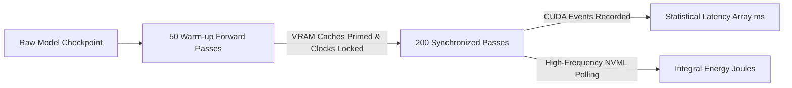

# Benchmarking, Fairness & Scientific Reproducibility Protocol

Reproducibility is the foundational cornerstone of the **CNN Optimization Benchmark Platform**. This document details the hardware isolation protocols, CUDA synchronization standards, random seed policies, statistical aggregation formulas, and fairness verification engines built into the platform.

---

## 1. The 5 Principles of Benchmarking Reproducibility

```
               ┌─────────────────────────────────────────────────────┐
               │    SCIENTIFIC REPRODUCIBILITY GUARANTEE             │
               └─────────────────────────┬───────────────────────────┘
                                         │
     ┌───────────────────┬───────────────┴───────────────┬───────────────────┐
     ▼                   ▼                               ▼                   ▼
┌──────────────┐  ┌──────────────┐                ┌──────────────┐    ┌──────────────┐
│ Deterministic│  │ Synchronized │                │ Cryptographic│    │ Hardware     │
│ Seed Policy  │  │ CUDA Timing  │                │ Provenance   │    │ Isolation    │
└──────────────┘  └──────────────┘                └──────────────┘    └──────────────┘
```

1. **Deterministic Seed Control**: Every stochastic search vector and weight initialization is seeded using an explicit arithmetic policy (`seed = base_seed + run_index`).
2. **Synchronized Hardware Timing**: Eliminates asynchronous queue buffer noise via `torch.cuda.synchronize()` and multi-pass warmup cycles.
3. **Automated Fairness Verification**: Verifies that competing algorithms execute against identical CNN models, validation splits, batch sizes, and quantization matrices.
4. **Cryptographic Provenance**: Every metric record is tagged with measurement timestamps, device IDs, host OS signatures, and method descriptions.
5. **Statistical Distribution Rigor**: Replaces single cherry-picked numbers with full distributions: Mean ($\mu$), Median ($M$), Standard Deviation ($\sigma$), and 95% Confidence Intervals ($\text{CI}_{95}$).

---

## 2. Hardware Isolation & Measurement Protocol

### 2.1 Warmup & Measurement Phases
Hardware accelerators (GPUs, TPUs, NPUs) exhibit dynamic thermal scaling, power state transitions (P-States), and just-in-time (JIT) shader compilation overheads on the first few forward passes.



* **Warm-up Passes**: 50 unmeasured forward passes.
* **Measured Passes**: 200 high-resolution timed passes synchronized with CUDA events.

### 2.2 VRAM & Cache Reset Protocol
Between consecutive algorithm runs, the platform resets runtime memory:
```python
import gc
import torch

def reset_hardware_state():
    gc.collect()
    if torch.cuda.is_available():
        torch.cuda.empty_cache()
        torch.cuda.reset_peak_memory_stats()
        torch.cuda.synchronize()
```

---

## 3. Multi-Run Statistical Aggregation Formulations

For an algorithm evaluated over $N$ stochastic runs ($r = 1, \dots, N$):

### 1. Sample Mean ($\mu$):
$$\bar{x} = \frac{1}{N} \sum_{r=1}^{N} x_r$$

### 2. Sample Standard Deviation ($\sigma$):
$$s = \sqrt{\frac{1}{N - 1} \sum_{r=1}^{N} (x_r - \bar{x})^2}$$

### 3. Standard Error of the Mean ($\text{SE}$):
$$\text{SE} = \frac{s}{\sqrt{N}}$$

### 4. 95% Confidence Interval ($\text{CI}_{95}$):
$$\text{CI}_{95} = \bar{x} \pm t_{0.025, N-1} \cdot \text{SE}$$

Where $t_{0.025, N-1}$ is the critical two-tailed value from Student's $t$-distribution with $N-1$ degrees of freedom (e.g. $t = 2.776$ for $N=5$).

---

## 4. Benchmark Fairness Verification Engine

The platform includes an automated fairness verification endpoint (`POST /api/experiments/validate-fairness`) that mathematically verifies parity across experimental runs:

| Dimension Checked | Parity Requirement | Failure Condition |
| :--- | :--- | :--- |
| **CNN Architecture** | Exact layer count, filter dimensions, and initial state dict | Architecture mismatch |
| **Dataset & Split** | Identical test subset partition and input image resolution | Unequal evaluation data |
| **Batch Size** | Constant batch size across all inference calls (e.g. 64) | Throughput bias |
| **Quantization Scheme** | Uniform PTQ method (e.g. INT8 with MinMax calibration) | Mixed precision bias |
| **Search Space Bounds** | Identical continuous bounds $[0.0, 1.0]^D$ and population $N$ | Unequal search budget |
| **Hardware Device** | Identical host GPU/CPU profile and driver environment | Cross-hardware invalidity |

---

## 5. Provenance & Audit Trail Metadata

Every row in the database `metric_records` table preserves complete provenance:
- `experiment_id`: Unique identifier (e.g. `EXP-20260827-0001`)
- `algorithm_acronym`: e.g. `GWO`
- `metric_name`: e.g. `latency`, `accuracy`, `energy`, `model_size`
- `metric_value`: Exact measured float
- `unit`: `ms`, `%`, `J`, `MB`
- `provenance`: `MEASURED`, `CALCULATED`, or `ESTIMATED`
- `measurement_method`: Detailed description of the execution harness
- `source`: Host execution worker profile
- `timestamp`: UTC timestamp with microsecond resolution
